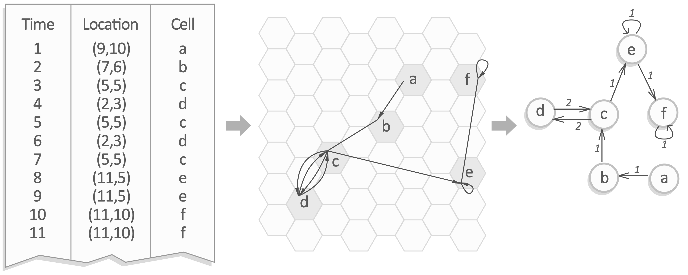

# Chronnets 
### A network-based network for spatiotemporal data analysis
##### Leonardo N. Ferreira, Didier A. Vega-Oliveros, Moshé Cotacallapa, Manoel F. Cardoso, Marcos G. Quiles, Liang Zhao, and Elbert E. N. Macau

<br>



### Code

All the algorithms and experiments used in this paper were implemented using [R](https://www.r-project.org/). [Download](https://github.com/lnferreira/chronnets/zipball/master) the code and open the R folder. There are 2 files:

##### R/
   * ```chronnets.R```
      - Methods implementation
   * ```run_example.R```
      - Example of how to construct chronnets

If you used this code, please cite our paper.

### Contact

If you have questions or sugestions, send us an email:

**Leonardo N. Ferreira**<br>
[ferreira@leonardonascimento.com](mailto:ferreira@leonardonascimento.com)<br>
[leonardoferreira.com](https://leonardoferreira.com)

**Didier A. Vega-Oliveros**<br>
[davo@icmc.usp.br](mailto:davo@icmc.usp.br)<br>
[didiervega.github.io](https://didiervega.github.io/)
